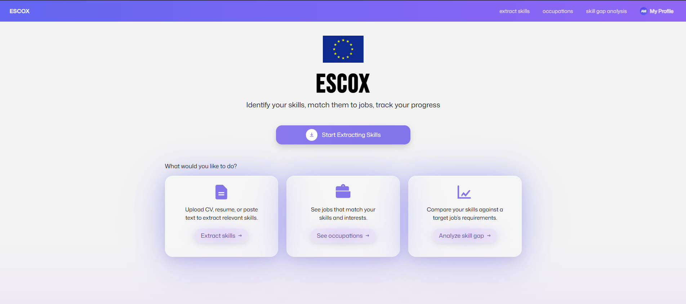
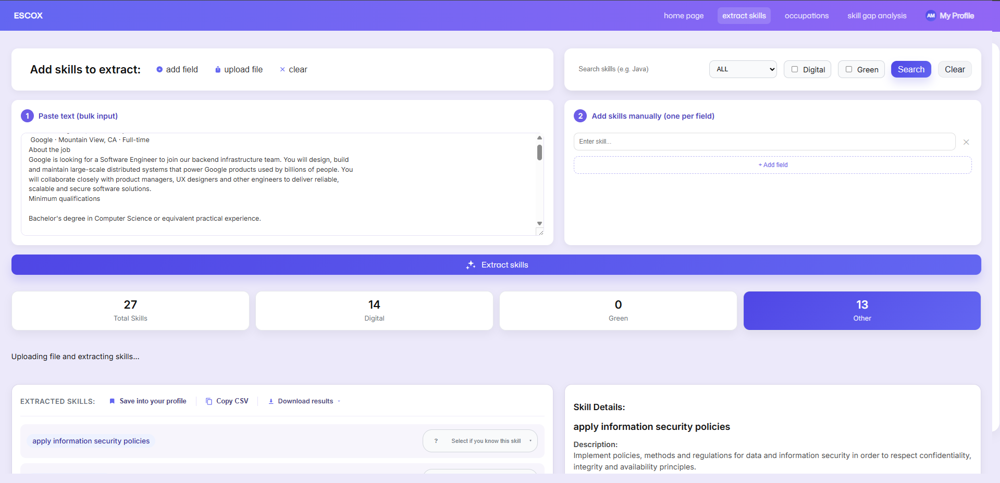
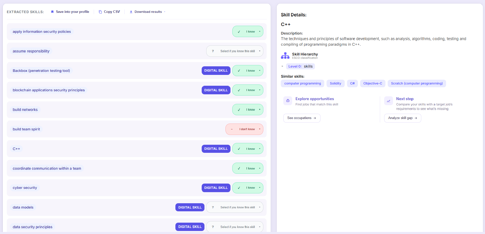
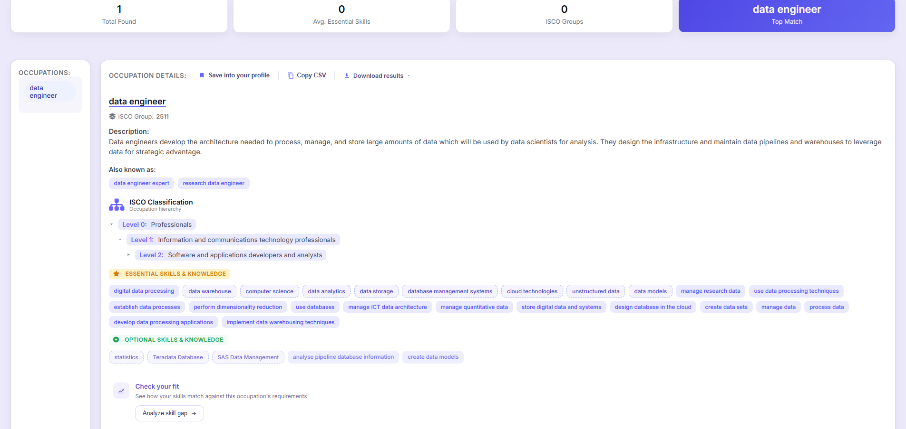
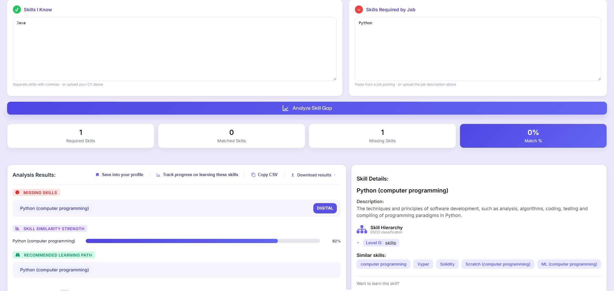
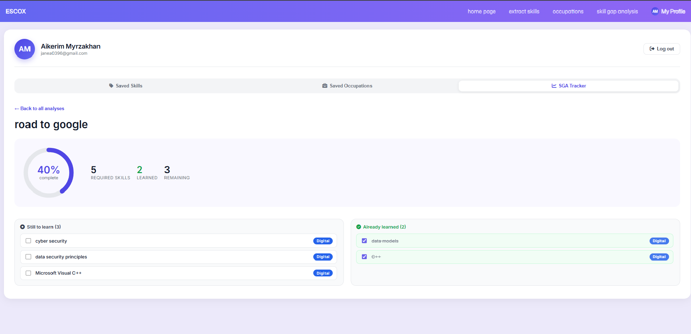

# ESCOX 2.0

A full-stack web application based on ESCO classification with main skill extraction, occupation matching, and skill gap analysis features. Built as an extension of the original [ESCOSkillExtractor](https://github.com/KonstantinosPetrakis/esco-skill-extractor) tool, adding user accounts, saved results, and progress tracking on top of the core extraction engine.

## Features

1. Skill extraction - extract ESCO-aligned skills from free text, CVs (PDF/DOCX/TXT), or manual entry
2. Occupation matching - find matching ISCO occupations based on skills or job descriptions, with essential/optional skill breakdowns and ISCO classification hierarchy
3. Skill gap analysis - compare "skills you have" against "skills a role needs," with similarity scoring and a recommended learning path
4. User accounts - register/login system with saved extraction results and analyses
5. Progress tracking - an SGA tracker that lets users check off missing skills as they learn them, with visual progress indicators
6. Digital & Green skill tagging - flags skills classified as digital or green competencies per the ESCO taxonomy
7. Search & filter - search the full ESCO skill/occupation database directly, with filters by skill type, digital, and green classification
8. Cross-page workflows - mark extracted skills as known/needed and carry them directly into skill gap analysis or occupation search; jump from an occupation straight into a pre-filled gap analysis with "Check your fit"
9. Export & download - export results as JSON, CSV, or Excel from any results page

## Screenshots

### Home page


### Skill extraction


### Skill extraction results


### Occupation extraction results


### Skill gap analysis


### SGA Tracker


## Requirements

- Python 3.10+
- pip

## Installation

```bash
git clone https://github.com/aikerimmyrzakhan-maker/escox-2.0.git
cd escox-2.0
python -m venv .venv
.venv\Scripts\activate      # Windows
# source .venv/bin/activate  # macOS/Linux
pip install -r requirements.txt
```

## Running the app

```bash
python -m esco_skill_extractor --host localhost --port 8000
```

Then open `http://localhost:8000` in your browser.

### CLI options

| Argument | Description | Default |
|---|---|---|
| `--model`, `-m` | Sentence-transformer model used for embeddings | `all-MiniLM-L6-v2` |
| `--skill_threshold`, `-s` | Cosine similarity threshold for skill matches | `0.6` |
| `--occupation_threshold`, `-o` | Cosine similarity threshold for occupation matches | `0.55` |
| `--device`, `-d` | Torch device to run on | `cuda` if available, else `cpu` |
| `--host`, `-c` | Host to serve on | `localhost` |
| `--port`, `-p` | Port to serve on | `8000` |

## Notes

- On first run, the app builds sentence-transformer embeddings for skills, occupations, and the skill hierarchy. This may take a few minutes and is cached to disk afterward.
- A local SQLite database (`userdata.db`) is created automatically to store user accounts, saved items, and SGA tracker progress.
- Supports uploading CVs or job descriptions as PDF, DOCX, or TXT for automatic skill extraction.

## Built on

This project is an enhanced and expanded version of the original ESCOX / ESCOSkillExtractor tool, extending it with a full user account system, occupation matching, skill gap analysis, and progress tracking. The original engine is described in:

Dimitrios Christos Kavargyris, Konstantinos Georgiou, Eleanna Papaioannou, Konstantinos Petrakis, Nikolaos Mittas, Lefteris Angelis, *ESCOX: A tool for skill and occupation extraction using LLMs from unstructured text*, Software Impacts, 2025. https://doi.org/10.1016/j.simpa.2025.100772

## Author 

Aikerim Myrzakhan — undergraduate thesis, Department of Informatics, Aristotle University of Thessaloniki (AUTH). Supervisor: Eleftherios Angelis.
